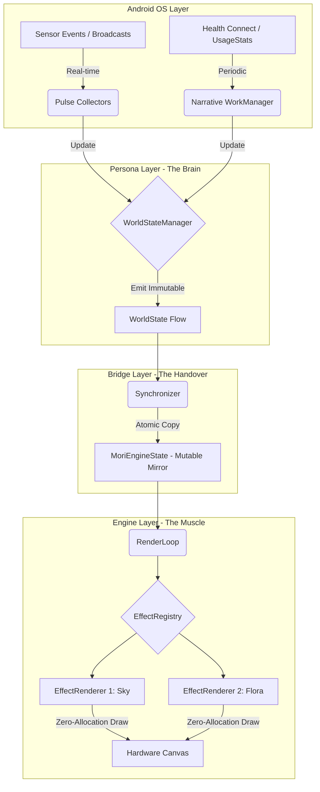

# Architecture: The Agnostic Platform

Mori is built on a strict unidirectional data flow, enforced by Gradle modules. This architecture protects the rendering thread from Android framework overhead and ensures zero-allocation performance at 60 FPS.

## 1. The "Mori Machine" (Visual Flow)

---

## 2. The 5 Modules

1.  **App Layer (`:app`)**
    *   **Role:** The Orchestrator.
    *   **Responsibilities:** Manages the `WallpaperService` lifecycle, initializes the Koin dependency graph, and binds the Persona's data lifecycle to the Engine's visibility.

2.  **UI Layer (`:ui`)**
    *   **Role:** The Face (Pulse Design System).
    *   **Responsibilities:** Atmospheric onboarding, progressive permission disclosure, and the Data-as-Art dashboard. Built with Jetpack Compose.

3.  **Persona Layer (`:persona`)**
    *   **Role:** The Brain.
    *   **Responsibilities:** 
        *   **Pulse:** `BroadcastReceivers` for real-time events (Battery, DND, Time).
        *   **Narrative:** `WorkManager` for high-latency background data (Health, Usage Summaries).
        *   **Normalization:** Flattens all data into a single, primitive-only `WorldState`.

4.  **Biome Layer (`:biome`)**
    *   **Role:** The DSL & Assets.
    *   **Responsibilities:** Interprets declarative JSON configurations (The Rule Engine). Manages the `BitmapTextureAtlas` and maps triggers to visual properties.

5.  **Engine Layer (`:engine`)**
    *   **Role:** The Muscle (Rendering VM).
    *   **Responsibilities:** A "dumb" rendering loop driven by the Android `Choreographer`. Consumes raw pixel data from the `MoriEngineState` mirror. Strictly isolated from Android Framework UI libraries.

---

### 3. The Smart Handover (Sync Strategy)

To achieve **Zero-Allocation** in the rendering loop, we use a **Mirror Sync** protocol:

1.  **The Snapshot:** The Persona layer emits an immutable `WorldState` data class (The Brain).
2.  **The Collection:** A background **Synchronizer** collects this snapshot on a dedicated thread.
3.  **The Atomic Copy:** Values are copied field-by-field into a pre-allocated **MoriEngineState** (The Mirror).
4.  **The Draw:** The **Engine** reads directly from the mirror's primitive fields during its 16ms draw window.

This ensures that the rendering thread never touches the Android Framework, never allocates memory, and never encounters a `ConcurrentModificationException`.

---

## 4. Architectural Debt & Evolution (Phase 1 Status)

> **Note (Phase 1):** Current Engine implementation (`MoriEngine`) has temporary direct dependencies on `android.view.SurfaceHolder` and `android.graphics.Canvas`. These will be decoupled in **Phase 3 (The Bridge)** to achieve pure rendering isolation and platform-agnostic logic.

