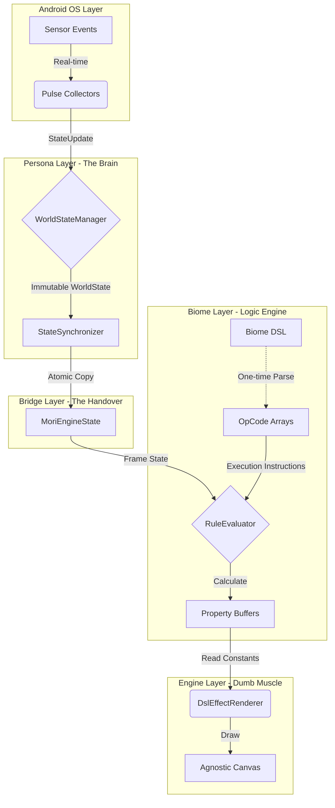

# Architecture: The Agnostic Platform

Mori is built on a strict unidirectional data flow, enforced by Gradle modules. This architecture protects the rendering thread from Android framework overhead and ensures zero-allocation performance at 60 FPS.

## 1. The "Mori Machine" (Visual Flow)

The system transforms raw environmental data into atmospheric visual properties via a stack-based Rule Engine.

---

## 2. The 6 Modules

1.  **App Layer (`:app`)**
    *   **Role:** The Orchestrator & UI Bridge.
    *   **Responsibilities:** Manages the `WallpaperService` lifecycle. Hosts app-level Composables like `PulseBackdrop` that bridge the `:engine`'s state into the `:ui`'s `PulseTheme`.

2.  **UI Layer (`:ui`)**
    *   **Role:** The Agnostic Design System (Pulse).
    *   **Responsibilities:** Provides a library of pure, stateless Jetpack Compose components and the `PulseTheme` wrapper. Has **zero knowledge** of the Mori engine.

3.  **Persona Layer (`:persona`)**
    *   **Role:** The Brain.
    *   **Responsibilities:** Collects real-world data from device sensors and normalizes it into the immutable `WorldState`.

4.  **Bridge Layer (`:bridge`)**
    *   **Role:** The Translator.
    *   **Responsibilities:** Centralizes the "Data Handover" from Persona to Engine. Handles all DP-to-Pixel math and metric calculations to keep the Engine "dumb" and pixel-pure.

5.  **Biome Layer (`:biome`)**
    *   **Role:** The Logic Engine (Phase 6/7).
    *   **Responsibilities:** Interprets declarative configurations (DSL) into primitive OpCodes. Manages the high-performance `BitmapTextureAtlas` and maps triggers to visual properties.

6.  **Engine Layer (`:engine`)**
    *   **Role:** The "Dumb" Muscle (Rendering VM).
    *   **Responsibilities:** A platform-agnostic rendering core. Orchestrates the loop but delegates all visual and theme decisions to the active `MoriWallpaper`.

---

## 3. The "Update-First" Rendering Cycle

To ensure data integrity and zero-allocation synthesis, the engine follows a strict three-phase cycle on every frame:

1.  **UPDATE**: `MoriEngine` updates the `LayerManager`. Every renderer calculates its internal logic (positions, scales, colors) based on the latest state.
2.  **SYNTHESIZE**: `MoriWallpaper` aggregates `RendererPalette` contributions from all updated layers to determine the final UI theme for the frame.
3.  **DRAW**: Renderers perform their "dumb" drawing operations using the now-consistent state results.

---

## 4. Engineering Standards

### Zero-Allocation Mandate
*   **The Render Loop**: No `new` or `.copy()` inside the `drawFrame` loop.
*   **Macro-OpCode VM**: Logic is executed using primitive `IntArray` bytecode and a pre-allocated `FloatArray` stack.
*   **Property Buffers**: Results are written into flat memory buffers, ensuring 0 heap allocations during the hot path.
*   **Cached Contributions**: Renderers use a caching strategy for `RendererPalette` objects to avoid per-frame allocations.

### Perceptual Design
*   **OKLab Synthesis**: All atmospheric color transitions are performed in OKLab space to prevent "muddy" desaturation during sunrise/sunset cycles.

---

## 5. Phase Retrospectives

### Phase 1: The Agnostic Platform
*   **Decisions**: Established strict UDF via `StateManager`. Decoupled rendering from Android `Canvas` via `EngineCanvas` interface.

### Phase 3: The Engine Bridge
*   **Decisions**: Implemented the "Stage vs. Actor" model. Centralized all DP-to-Pixel math in the Bridge to keep the Engine "dumb."

### Phase 4: Persona (Data Collectors)
*   **Decisions**: Implemented Grade-based energy ratings for sensors. Introduced the "Burst" sensor strategy for battery efficiency.

### Phase 5: Pulse Design System
*   **Decisions**: Unified the entire app UI under a single engine-driven `PulseTheme`. Refactored `PulseButton` to ensure 100% theme compliance.

---

## 6. The Future: Phases 6 & 7
The current goal is to transition Mori from hardcoded Kotlin renderers to a declarative, data-driven system. This is achieved via a stack-based **Macro-OpCode VM** that allows complex atmospheric logic to be defined in JSON and executed with Zero-Allocation performance.
