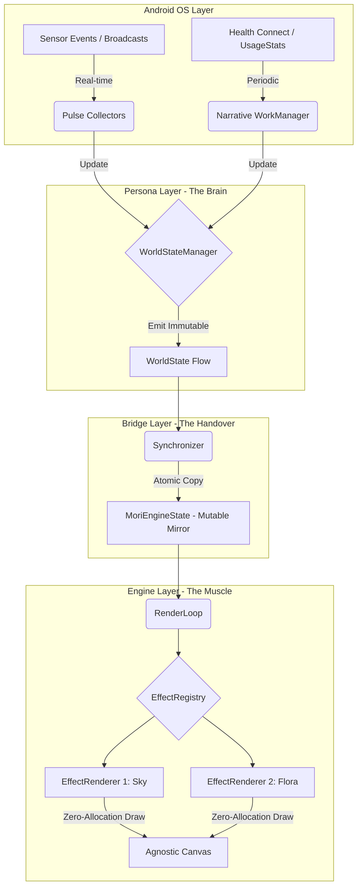

# Architecture: The Agnostic Platform

Mori is built on a strict unidirectional data flow, enforced by Gradle modules. This architecture protects the rendering thread from Android framework overhead and ensures zero-allocation performance at 60 FPS.

## 1. The "Mori Machine" (Visual Flow)

---

## 2. The 5 Modules

1.  **App Layer (`:app`)**
    *   **Role:** The Orchestrator.
    *   **Responsibilities:** Manages the `WallpaperService` lifecycle, initializes the Koin dependency graph, and binds the Persona's data lifecycle to the Engine's visibility. Implements Android-specific components like `ChoreographerTicker` and `SurfaceHolderRenderSurface`.

2.  **UI Layer (`:ui`)**
    *   **Role:** The Face (Pulse Design System).
    *   **Responsibilities:** Atmospheric onboarding, progressive permission disclosure, and the Data-as-Art dashboard. Built with Jetpack Compose.

3.  **Persona Layer (`:persona`)**
    *   **Role:** The Brain.
    *   **Responsibilities:** 
        *   **Pulse:** `BroadcastReceivers` for real-time events (Battery, DND, Time).
        *   **Narrative:** `WorkManager` for high-latency background data (Health, Usage Summaries).
        *   **Normalization:** Flattens all data into a single, primitive-only `WorldState`.

4.  **Biome Layer (`:biome`)**
    *   **Role:** The DSL & Assets.
    *   **Responsibilities:** Interprets declarative JSON configurations (The Rule Engine). Manages the `BitmapTextureAtlas` and maps triggers to visual properties.

5.  **Engine Layer (`:engine`)**
    *   **Role:** The Muscle (Rendering VM).
    *   **Responsibilities:** A platform-agnostic rendering core. Interacts with the platform via `EngineTicker` and `RenderSurface` interfaces. Consumes raw pixel data from the `MoriEngineState` mirror. Strictly isolated from the Android Framework.

---

## 3. The Smart Handover (Sync Strategy)

To achieve **Zero-Allocation** in the rendering loop, we use a **Mirror Sync** protocol managed by the **`:bridge`** module:

1.  **The Snapshot:** The Persona layer emits an immutable `WorldState` data class (The Brain).
2.  **The Collection:** The **StateSynchronizer** (in the Bridge) collects this snapshot on a dedicated background thread.
3.  **The Atomic Copy:** Values are copied field-by-field into a pre-allocated **MoriEngineState** (The Mirror).
4.  **The Geometry Translation:** The Bridge applies screen density corrections to any DP-based values, converting them into raw Pixels.
5.  **The Draw:** The **Engine** reads directly from the mirror's primitive fields during its 16ms draw window.

This ensures that the rendering thread never touches the Android Framework, never allocates memory, and never encounters a `ConcurrentModificationException`.

---

## 4. Phase 1 Retrospective: The Agnostic Platform

**Status:** Completed (March 2026)

### Summary of Decisions
1.  **Strict UDF (StateManager):** We split the state hub into read-only (`StateManager`) and internal-only (`MutableStateManager`) interfaces to physically prevent state mutation from outside the `:persona` module.
2.  **Service-as-Orchestrator:** Moved `MoriWallpaperService` to the `:app` module. This ensures the `:engine` module remains a pure drawing library while `:app` manages the complex binding between the "Brain" (Persona) and the "Muscle" (Engine).
3.  **Feature-Based Hierarchy:** Reorganized modules into `.state`, `.lifecycle`, `.sensor`, and `.core` packages to support long-term scalability and internal encapsulation.
4.  **Decoupled Rendering:** Extracted `EngineTicker` and `RenderSurface` interfaces to isolate the `:engine` module from the Android Framework (`Canvas`, `Choreographer`, `SurfaceHolder`). This enables platform-agnostic testing and future-proofs the rendering logic.

---

## 6. Phase 3 Retrospective: The Engine Bridge

**Status:** Completed (March 2026)

### Summary of Decisions
1.  **The Dedicated :bridge Module:** Extracted all handover logic from the `:app` module into a standalone `:bridge` Android Library. This ensures the app entry point remains a thin wrapper while the complex translation logic is isolated and unit-testable.
2.  **The "Stage vs. Actor" Model:** Established a clear boundary between geometry and rendering. The Bridge acts as the **Stage Manager**, pre-calculating viewport bounds and scale factors, while the Engine's renderers act as **Actors** that simply read those pixel-perfect limits.
3.  **Zero-Allocation Data Handover:** Implemented the `StateSynchronizer` using manual field-by-field mapping from `WorldState` to `MoriEngineState`. This satisfies the core mandate by ensuring no garbage collection pressure is created during the data transfer.
4.  **Virtual Camera (MetricCalculator):** Centralized all DP-to-Pixel and aspect-ratio math into a single component. Supporting `FIT` and `FILL` scaling modes ensures the wallpaper is robust against Android's diverse screen ecosystem.

### State of the Machine
*   **The Translator (:bridge):** Robust. Handles background state collection, atomic mirroring, and density-aware coordinate scaling.
*   **The Blueprint (:engine):** Ready for high-level art. All renderers now have immediate access to a "Safe Zone" pixel boundary without performing math.
