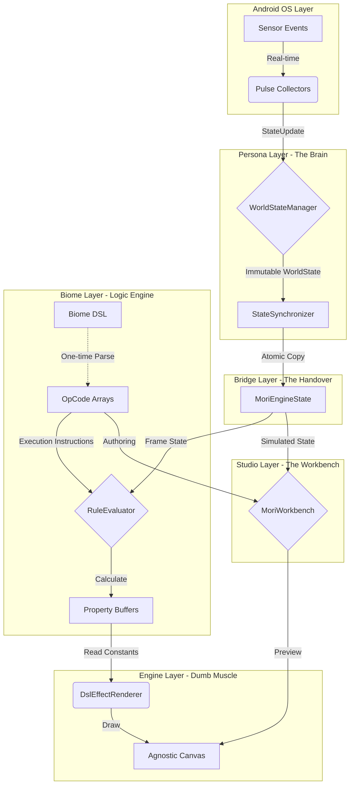

# Architecture: The Agnostic Platform

---
**Documentation Suite:** **[Architecture](ARCHITECTURE.md)** | [Biome DSL](SPEC_DSL.md) | [Instruction Set (ISA)](SPEC_ISA.md) | [Tutorial](TUTORIAL_CANVAS.md)
---

Mori is built on a strict unidirectional data flow, enforced by Gradle modules. This architecture protects the rendering thread from Android framework overhead and ensures zero-allocation performance at 60 FPS.

## 1. The "Mori Machine" (Visual Flow)

The system transforms raw environmental data into atmospheric visual properties via a stack-based Rule Engine.

---

## 2. The 7 Modules

1.  **App Layer (`:app`)**
    *   **Role:** The Orchestrator & UI Bridge.
    *   **Responsibilities:** Manages the `WallpaperService` lifecycle. Hosts app-level Composables like `PulseBackdrop` that bridge the `:engine`'s state into the `:ui`'s `PulseTheme`.

2.  **UI Layer (`:ui`)**
    *   **Role:** The Agnostic Design System (Pulse).
    *   **Responsibilities:** Provides a library of pure, stateless Jetpack Compose components and the `PulseTheme` wrapper. Has **zero knowledge** of the Mori engine.

3.  **Persona Layer (`:persona`)**
    *   **Role:** The Brain.
    *   **Responsibilities:** Collects real-world data from device sensors and normalizes it into the immutable `WorldState`.

4.  **Bridge Layer (`:bridge`)**
    *   **Role:** The Translator.
    *   **Responsibilities:** Centralizes the "Data Handover" from Persona to Engine. Handles all DP-to-Pixel math and metric calculations to keep the Engine "dumb" and pixel-pure.

5.  **Biome Layer (`:biome`)**
    *   **Role:** The Logic Engine (Phase 6/7).
    *   **Responsibilities:** Interprets declarative configurations (DSL) into primitive OpCodes. Manages the high-performance `BitmapTextureAtlas` and maps triggers to visual properties.

6.  **Engine Layer (`:engine`)**
    *   **Role:** The "Dumb" Muscle (Rendering VM).
    *   **Responsibilities:** A platform-agnostic rendering core. Orchestrates the loop but delegates all visual and theme decisions to the active `MoriWallpaper`.

7.  **Studio Layer (`:studio`)**
    *   **Role:** The Workbench & Artist Interface.
    *   **Responsibilities:** A Compose Multiplatform Desktop environment. Provides real-time biome authoring, rule simulation, and asset packaging for artists.

---

## 3. The Rule Engine (Phase 6)

The logic core of Mori is a high-performance, stack-based Virtual Machine. It decouples visual behavior from Kotlin code by executing pre-compiled bytecode. For a complete list of supported mathematical operations and high-value macros, refer to the **[Instruction Set Architecture (SPEC_ISA.md)](SPEC_ISA.md)**.

### Execution Model
*   **Initialization**: JSON biomes are parsed once into primitive `IntArray` bytecode by the `BiomeDecoder`.
*   **Hot-Path**: On every frame, the `RuleEvaluator` executes this bytecode to calculate visual properties (Position, Rotation, Alpha, etc.).
*   **Purity**: The evaluator is a pure function that requires 0 object allocations during the frame cycle. It uses a pre-allocated `FloatArray` stack for all operations.
*   **Atomic Safety**: The VM includes guards for division-by-zero, stack overflow, and illegal operations, ensuring the engine remains stable even with malformed biome logic.

### 3.1 The Property Buffer (The VRAM Model)
Mori uses a "Flat Memory" bridge between the Rule Engine and the Renderers. Instead of passing complex objects, the results of rule evaluations are written into a fixed-size `FloatArray` called the `PropertyBuffer`.

*   **Size**: Fixed at 16 slots (`RenderProperty.BUFFER_SIZE`).
*   **Mapping**: Standard indices for X, Y, Scale, Rotation, Alpha, and Colors.
*   **Custom Slots**: 5 "Semantic Expansion" slots (INDEX_CUSTOM_A-E) for biome-specific logic or shader uniforms.
*   **Efficiency**: Renderers read directly from these buffers, ensuring high cache locality and 0 heap allocations during the drawing phase.

---

## 4. The "Update-First" Rendering Cycle

To ensure data integrity and zero-allocation synthesis, the engine follows a strict three-phase cycle on every frame:

1.  **UPDATE**: `MoriEngine` updates the `LayerManager`. Every renderer calculates its internal logic (positions, scales, colors) based on the latest state.
2.  **SYNTHESIZE**: `MoriWallpaper` aggregates `RendererPalette` contributions from all updated layers to determine the final UI theme for the frame.
3.  **DRAW**: Renderers perform their "dumb" drawing operations using the now-consistent state results.

---

## 5. Engineering Standards

### Zero-Allocation Mandate
*   **The Render Loop**: No `new` or `.copy()` inside the `drawFrame` loop.
*   **Macro-OpCode VM**: Logic is executed using primitive `IntArray` bytecode and a pre-allocated `FloatArray` stack.
*   **Property Buffers**: Results are written into flat memory buffers, ensuring 0 heap allocations during the hot path.
*   **Cached Contributions**: Renderers use a caching strategy for `RendererPalette` objects to avoid per-frame allocations.

### Zero-Meaning Design Principle
*   **Semantic Isolation**: The Engine and Persona modules are strictly agnostic. They process "Facts" and "Properties" without knowing their semantic meaning (e.g., whether a value represents "Battery" or "Hunger").
*   **Biome Interpretation**: All meaning is defined within the Biome's JSON DSL, which maps raw Facts to visual Properties via the Rule Engine.

### Perceptual Design
*   **OKLab Synthesis**: All atmospheric color transitions are performed in OKLab space to prevent "muddy" desaturation during sunrise/sunset cycles.
